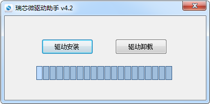
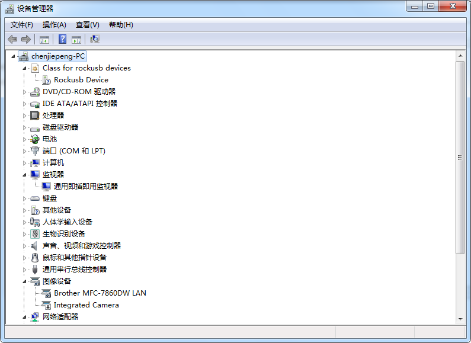
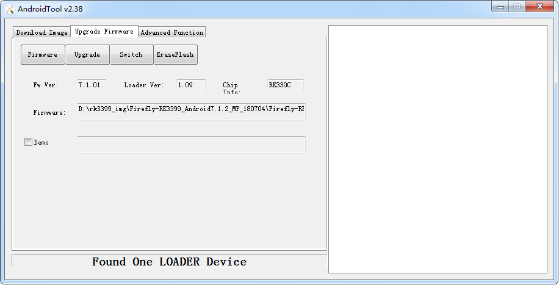

# 升级固件

## 前言

本文介绍了如何将主机上的固件文件，通过 双公头 USB 数据线烧录到开发板的闪存中。升级时，需要根据主机操作系统和固件类型来选择合适的升级方式。

## 准备工作

* AIO-3399J 开发板
* 固件
* 主机
* 良好的双公头 USB 数据线文介绍了如何将主机上的固件文件，通过双公头 USB 数据线烧录到开发板的闪存中。升级时，需要根据主机操作系统和固件类型来选择合适的升级方式。

固件文件一般有两种：

* 单个统一固件 update.img, 将启动加载器、参数和所有分区镜像都打包到一起，用于固件发布。
* 多个分区镜像,如 kernel.img, rootfs.img, recovery.img 等，在开发阶段生成。
* 可以在这里找到已编译好的统一 [AIO-3399J 固件]，下载后解压。也可以参考编译固件的说明自行编译。

主机操作系统支持：
> * Windows XP （32/64位）
> * Windows 7 (32/64位)
> * Windows 8 (32/64位)
> * Linux (32/64位)

## Windows

* 工具: [Androidtool_xxx(版本号)](http://www.t-firefly.com/doc/download/page/id/54.html#windows_12)

**<font color=#ff0000 >注意</font>**:不同固件使用的工具版本可能不同,请根据[烧写须知]下载对应的版本

### 安装 RK USB 驱动

下载 [ Release_DriverAssistant.zip](http://www.t-firefly.com/doc/download/page/id/3.html#other_11) ，解压，然后运行里面的 DriverInstall.exe 。为了所有设备都使用更新的驱动，请先选择`驱动卸载`，然后再选择`驱动安装`。



### 连接设备

设备进入升级模式的方式如下：

* 一种方法是设备先断开电源适配器和双公头 USB 数据线的连接：

   * 双公头 USB 数据线一端连接主机，一端连接开发板
   * 按住设备上的 RECOVERY （恢复）键并保持
   * 接上电源
   * 大约两秒钟后，松开 RECOVERY 键

* 另一种方法，无需断开电源适配器和双公头 USB 数据线的连接：

   * 双公头 USB 数据线一端连接主机，一端连接开发板
   * 按住设备上的 RECOVERY （恢复）键并保持
   * 短按一下 RESET（复位）键
   * 大约两秒钟后，松开 RECOVERY 键

主机应该会提示发现新硬件并配置驱动。打开设备管理器，会见到新设备 `Rockusb Device` 出现，如下图。如果没有，则需要返回上一步重新安装驱动。



## 烧写固件

下载 [AndroidTool](http://www.t-firefly.com/doc/download/page/id/3.html#windows_12)(**若系统是Android8.1则需要2.54以上版本**)，解压，运行 AndroidTool_Release_v2.38 目录里面的 AndroidTool.exe（注意，如果是 Windows 7/8,需要按鼠标右键，选择以管理员身份运行），如下图：


### 烧写统一固件 update.img

烧写统一固件 update.img 的步骤如下:

1. 切换至`升级固件`页。
2. 按`固件`按钮，打开要升级的固件文件。升级工具会显示详细的固件信息。
3. 按`升级`按钮开始升级。
4. <font color=#ff0000 >如果升级失败，可以尝试先按`擦除 Flash `按钮来擦除 Flash，然后再升级。一定要根据[烧写须知](upgrade_table.md)进行擦除烧写</font>

**注意：如果你烧写的固件 laoder 版本与原来的机器的不一致，请在升级固件前先执行`擦除 Flash `。**



### 烧写分区映像

每个固件的分区可能不相同,请注意以下两点:
1. 使用 `Androidtool_2.38` 烧写 `ubuntu(MBR)` 和 `Android7.1` 固件时使用默认配置即可;
2. 使用 `Androidtool_2.58` 烧写 `ubuntu(GPT)` 使用默认配置即可，烧写 `Android8.1` 固件请先执行以下操作:

   <font color=#ff0000 >切换至`下载镜像页面`; 右键点击表格，选择`导入配置`; 选择rk3399-Android81.cfg</font>

烧写分区映像的步骤如下：

1. 切换至`下载镜像`页。
2. 勾选需要烧录的分区，可以多选。
3. 确保映像文件的路径正确，需要的话，点路径右边的空白表格单元格来重新选择。
4. 点击`执行`按钮开始升级，升级结束后设备会自动重启。


## Linux

 Linux 下无须安装设备驱动，参照 Windows 章节连接设备则可。

* 工具:[upgrade_tool_xxx(版本号)](http://www.t-firefly.com/doc/download/page/id/54.html#linux_12)

**<font color=#ff0000 >注意</font>**:不同固件使用的工具版本可能不同,请根据[烧写须知]下载对应的版本

### upgrade_tool

下载 [Linux_Upgrade_Tool] (**系统是 Android8.1 则需要 Linux_Upgrde_Tool_for_android8.1**), 并按以下方法安装到系统中，方便调用：

```
unzip Linux_Upgrade_Tool_xxxx.zip
cd Linux_UpgradeTool_xxxx
sudo mv upgrade_tool /usr/local/bin
sudo chown root:root /usr/local/bin/upgrade_tool
sudo chmod a+x /usr/local/bin/upgrade_tool
```

烧写统一固件 update.img：

```
sudo upgrade_tool uf update.img
```

<font color=#ff0000 >如果升级失败，可以尝试先擦除后再升级。一定要根据[烧写须知]的表格 (upgrade_table.md) 进行擦除烧写</font>

```
# 擦除 flash 使用 ef 参数需要指定 loader 文件或者对应的 update.img
sudo upgrade_tool ef update.img   #update.img :你需要烧写的 Ubuntu 固件
# 重新烧写
sudo upgrade_tool uf update.img
```

烧写分区镜像：
Ubuntu(MBR)、Android7.1、Android8.1,使用以下方式:
```
sudo upgrade_tool di -b /path/to/boot.img
sudo upgrade_tool di -k /path/to/kernel.img
sudo upgrade_tool di -s /path/to/system.img
sudo upgrade_tool di -r /path/to/recovery.img
sudo upgrade_tool di -m /path/to/misc.img
sudo upgrade_tool di resource /path/to/resource.img
sudo upgrade_tool di -p paramater   #烧写 parameter
sudo upgrade_tool ul bootloader.bin # 烧写 bootloader
```

Ubuntu(GPT),使用以下方式
```
sudo upgrade_tool ul $LOADER
sudo upgrade_tool di -p $PARAMETER
sudo upgrade_tool di -uboot $UBOOT
sudo upgrade_tool di -trust $TRUST
sudo upgrade_tool di -b $BOOT
sudo upgrade_tool di -r $RECOVERY
sudo upgrade_tool di -m $MISC
sudo upgrade_tool di -oem $OEM
sudo upgrade_tool di -userdata $USERDATA
sudo upgrade_tool di -rootfs $ROOTFS
```


如果因 flash 问题导致升级时出错，可以尝试低级格式化、擦除 nand flash：
```
sudo upgrade_tool lf update.img	# 低级格式化
sudo upgrade_tool ef update.img	# 擦除
```
## 常见问题

### 如何强行进入 MaskRom 模式

如果板子进入不了 Loader 模式，此时可以尝试强行进入 MaskRom 模式。操作方法见[《如何进入 MaskRom 模式》](maskrom_mode.html)。


[烧写须知]: upgrade_table.html

[AIO-3399J 固件]: http://http://www.t-firefly.com/doc/download/page/id/31.html#other_80
[Linux_Upgrade_Tool]: http://www.t-firefly.com/doc/download/page/id/31.html#linux_12